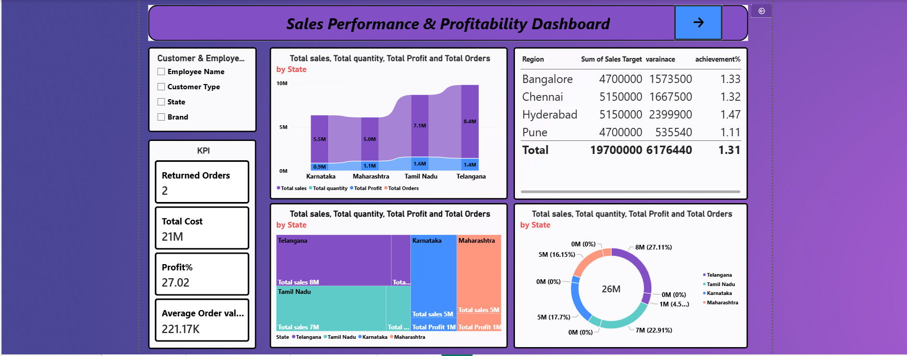

# Sales Performance & Profitability Dashboard — Power BI

## Project Overview

This project is an interactive Power BI dashboard created to analyze sales performance and profitability using business sales data.

## Tools & Skills Used

* Microsoft Power BI
* Power Query
* Data Cleaning
* Data Modeling
* DAX Measures
* Calculated Columns
* Relationships
* KPI Cards
* Slicers
* Charts
* Field Parameters
* Bookmarks
* Drill-through
* Data Visualization

## Key Analysis

The dashboard analyzes:

* Total Sales
* Total Profit
* Total Quantity
* Total Orders
* Region Performance
* Product Performance
* Employee Performance
* Customer Analysis
* Payment Mode Analysis

## Project Work

* Cleaned and transformed sales data using Power Query.
* Created relationships and built a data model.
* Created DAX measures for sales, profit, quantity, and orders.
* Built interactive dashboard visuals and KPI cards.
* Used field parameters for dynamic analysis.
* Added slicers and bookmarks for interactive navigation.
* Created drill-through functionality for detailed analysis.
* Generated business insights from sales and profitability data.

## Dashboard Features

* Interactive KPI cards
* Dynamic metric selection
* Dynamic dimension analysis
* Slicers and filters
* Bookmarks
* Drill-through
* Interactive charts
* Detailed analysis page

## Project Type

Personal Portfolio Project
## Dashboard Preview

